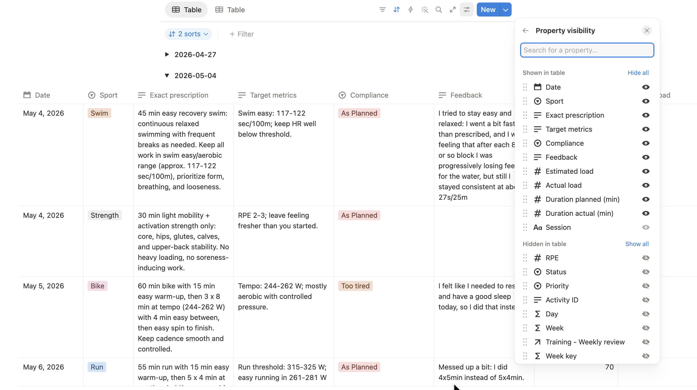

## Why I Ended Up Building an AI Training Assistant

I did not need another generic training plan. I needed a plan that understood
that I was trying to qualify again for high-level age-group racing while also
having a job, a family.

I am a serious amateur triathlete. I have represented Canada at the Triathlon
Age Group World Championship, and I am trying to qualify again for similar
events. That usually means one thing: ideally, I should have a coach.

That is the ideal version of reality.

The real version is that triathlon is expensive, [photography](https://theasjblog.github.io/art_portfolio/){target="_blank" rel="noopener"} is also
expensive, and a growing family tends to have strong opinions about what
counts as a reasonable monthly bill. A recurring coaching fee starts to look
less like a performance investment and more like something I would need to
explain carefully over dinner.

That is what pushed me toward building my own training-support system.

It was never about proving that software is better than a coach. It is not.
It was about building something that could help me train more intelligently
inside the constraints of actual life.

## The Problem

What I wanted was not just a plan. I wanted a way to:

- track how training was really going
- get a personalized next-week plan
- adapt that plan to my real availability
- stop re-explaining the same constraints to my virtual coach over and over

In other words, I wanted something that could react to the moving parts of my
actual training life instead of handing me the same answer every time.

That matters more than it sounds. There is a special kind of frustration in
looking at a beautifully structured training week that is completely detached
from the week you are actually about to live.

I did not want training to become one more source of background stress. I
wanted it to feel sustainable, especially if I was going to keep chasing big
goals.

## The Path That Led Here

Like a lot of athletes, I started with downloaded plans from the internet.
That is a normal first step. They are simple, cheap, and often good enough to
make you better.

And to be fair, they do work for a while. But the better you get, the more you
notice the gap between a plan that looks good on paper and a plan that fits
your life, your fatigue, and your actual goals.

Then I moved to Humango. It worked well enough for a while. In fact, it was
great: I qualified for Team Canada in the year I used it. But over time I ran
into problems. I wanted something that fit more naturally with my own
workflow and had better access to the information I cared about.
And after later product changes, some of the features I relied on most,
especially around coach interaction and availability-based adjustments, stopped
working the way I needed.

So I tried going straight to ChatGPT.

That was fun at first. I was getting nice personalized plans, decent advice,
and I could test ideas in real time. Then the honeymoon phase ended. The
longer the conversation became, the slower it got. It sometimes confused days.
It could forget updated training zones. And I found myself starting too many
chats with some version of:

"Today is Thursday, these are my current zones, and no, I cannot do a long
ride in the middle of a workday."

That was the moment I realized the problem was not just "I need AI." The
problem was "I need AI inside a structure I can trust."

## The Idea Behind the New System

The main change was simple: stop asking the model to remember everything, and
give it a cleaner job.

Instead of relying on one long conversation, I moved the changing parts of my
training life into structured places:

- availability
- races
- athlete profile
- weekly review
- settings such as zones and thresholds

And I moved the stable rules into the system itself:

- do not prescribe sports that I cannot do that day
- do not exceed the maximum number of sessions I can do
- keep weekday sessions inside reasonable limits
- respect the broader training context: build phase and taper phase
  require very different sessions

That way, the AI is not improvising from memory. It is working from organized
information and fixed rules.

That was the real shift. I stopped treating the AI like an all-knowing coach
and started treating it like one part of a system.

## The Tools I Use

The setup that works for me today is built around three main pieces:

- `Intervals.icu` for training data and activity history
- `Notion` for organizing availability, races, athlete profile, reviews, and
  planning context
- `Codex + ChatGPT/OpenAI` for turning that context into a weekly review and a
  next-week draft plan

None of these tools is doing everything.

Intervals.icu is where training data lives naturally. Notion gives me a place
to keep the moving parts organized. The AI is used for interpretation and
drafting, not for pretending it is the entire system.

That division matters more than it sounds.

If you want the more detailed technical version of how this works, I wrote it
[here](https://theasjblog.github.io/analytics_blog/posts/2026-05-10_coach_ai/){target="_blank" rel="noopener"}.

## What the Weekly Workflow Looks Like

At a high level, the process looks like this:

```{mermaid}
flowchart TD
    A["Workouts and activity data"] --> D["Organized weekly workflow"]
    B["Availability, races,<br/>profile, and notes"] --> D
    D --> E["Weekly review"]
    E --> F["Draft next-week plan"]
    F --> G["Rule checks"]
    G -->|valid| H["Final plan"]
    G -->|invalid part only| I["Repair that part"]
    I --> F
```

The important part is not the diagram. The important part is the behavior.

The system reviews what happened, drafts what comes next, and checks the draft
against reality. If one part is wrong, it fixes it.

The biggest payoff was not that everything suddenly became perfect. It was
that the plan stopped feeling detached from my real life. It started feeling
more like support and less like one more thing I had to manage manually.

## Why That Feels Better Than Plain Chat

This is the biggest difference in day-to-day use: the system feels calmer.

I am no longer hoping the AI remembers what I told it three weeks ago. My
zones live in one place. My availability lives in one place. My races live in
one place. The weekly plan is built from that context instead of from whatever
the conversation happened to remember.

That does not make it magical. It makes it more repeatable.

{fig-cap="Weekly availability in Notion, including allowed sports, maximum sessions, and scheduling notes."}

## One Simple Example

Suppose Tuesday is marked as run-only, with one session maximum, and I only
have an hour available.

If the AI proposes something silly there, like a 2h ride, the system does not
just shrug and call it creativity. It catches the mismatch and asks for that
specific session to be repaired, all automatically, without me having to
intervene at all.

That is exactly the kind of behavior I wanted.

::: {.callout-note appearance="simple"}
**Example: draft session repair**

:::: {.columns}
::: {.column width="50%"}
**Wrong prescription**

```json
{
  "day": "Tuesday",
  "sport": "bike",
  "duration": "2h",
  "notes": "Endurance ride"
}
```
:::

::: {.column width="50%"}
**Corrected version**

```json
{
  "day": "Tuesday",
  "sport": "run",
  "duration": "45min",
  "notes": "Easy aerobic run"
}
```
:::
::::

Tuesday is marked as run-only, with a maximum of one session and
roughly one hour available, so the repair step replaces the invalid bike
workout with a compliant run session.
:::

## Why I Like It

This setup will not be for everyone, but for me it has a few clear
advantages.

- it is more personalized than a static plan
- it adapts better to real life than a generic template
- it is more repeatable than re-running the same conversation forever
- it is relatively cost-effective
- it lets me keep using tools I already trust

It also gives me a much better feeling of control. Not total control, because
that would be a lie. But enough control that I can trust the workflow.

And for me, that trust is the whole point. A plan only helps if I can actually
live with it for months, not just admire it for five minutes.

## Final Thoughts

So far, I really like this system.

It gives me a middle ground between generic plans and full human coaching. It
helps me keep context organized, adapt training to actual life, and get
personalized plans without starting from scratch every week.

That said, I would still tell any athlete the same thing: if you can work with
a good human coach, do that.

A coach is still better. A coach brings judgment, motivation, experience, and
accountability in a way software does not. And if you are a less experienced
athlete, it is much easier to miss bad suggestions when they come from a
system that sounds confident.

For me, though, this has been a very useful compromise. It is practical, a bit
nerdy, and surprisingly effective.

## How It Compares

If I had to summarize the landscape, I would put it like this: pre-made plans
are the easiest place to start, Humango sits in the middle as a more adaptive
commercial product, plain ChatGPT is flexible but fragile, and this system is
the most work upfront but gives me the best balance of structure and
adaptability.

| Comparison item | Pre-made plans | Humango | ChatGPT alone | This system |
|---|---|---|---|---|
| Cost | Low | Medium to high | Low to medium | Low to medium |
| Ease of setup | Very easy | Easy | Very easy | Hardest |
| Adaptability | Low | Medium to high | High in theory | High |
| Ease of daily use | Easy | Easy | Medium | Medium |
| Context reliability | High, but static | Medium | Low | High |
| Main advantage | Simple, cheap, predictable | Adaptive and more structured | Flexible and conversational | Flexible, structured, and grounded in real context |
| Main disadvantage | Too generic | Product limits and subscription cost | Memory drift and inconsistent outputs | More effort to build and maintain |

## What It Costs

Another reason I like this setup is that it is pretty affordable to run.
`Intervals.icu` is free, though I strongly recommend supporting the project.
In my case that works out to less than 50 CAD per year after taxes. `Notion`
is on the free plan. For the OpenAI side, I do not need a ChatGPT
subscription at all because I am using the API directly, and the weekly cost
has usually been around 5 cents or less.

| Component | What I use | Approximate cost |
|---|---|---|
| Intervals.icu | Supporter tier | < 50 CAD/year |
| Notion | Free plan | 0 |
| OpenAI API | Weekly review + plan generation | about 0.05 CAD/week or less |
| ChatGPT subscription | Not required | 0 |

That affordability matters because it keeps the system in the category of
"useful tool" rather than "another recurring expense I need to justify." That
was one of the original goals, and so far it has held up well.
